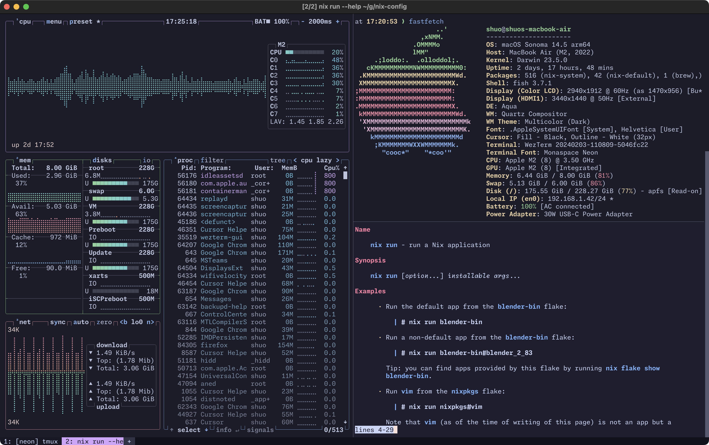

# Nix/MacOS System Configurations

This repository contains my own personal MacOS (using
[nix-darwin](https://github.com/LnL7/nix-darwin)) and
[home-manager](https://github.com/nix-community/home-manager) system
configurations. I use this to provision my MacOS instance, as well as provision
the same environment on Linux systems (currently non-NixOS) using standalone
home-manager.

> [!IMPORTANT]
> This is a work in progress and may not work as expected. It isn't
> intended to be used by other people in their own setup, but feel free to
> reference it as you get into using `nix`.



## Setup

1. Install `nix` (if not on NixOS) I prefer to use the [Determinate Systems
installer](https://github.com/DeterminateSystems/nix-installer).

```sh
curl --proto '=https' --tlsv1.2 -sSf -L https://install.determinate.systems/nix | sh -s -- install
```

2.a Initialize the MacOS system, with home-manager as a module

```sh
nix run nix-darwin -- switch --flake .
```

2.b. Initialize home-manager on a Linux system

```sh
nix run home-manager -- switch --flake .
```

3.a. Reload the full system on MacOS

```sh
darwin-rebuild switch --flake .
```

3.b. Reload home-manager on a Linux system

```sh
home-manager switch --flake .
```
